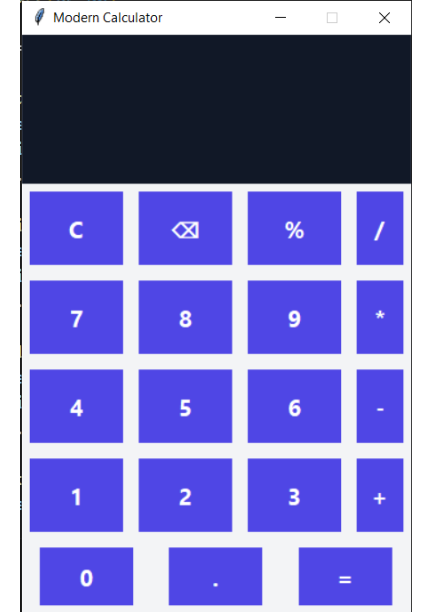
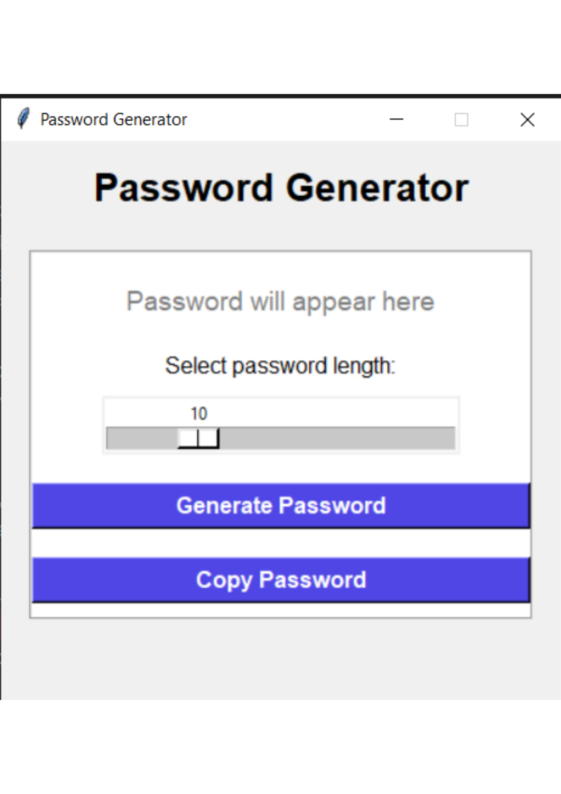
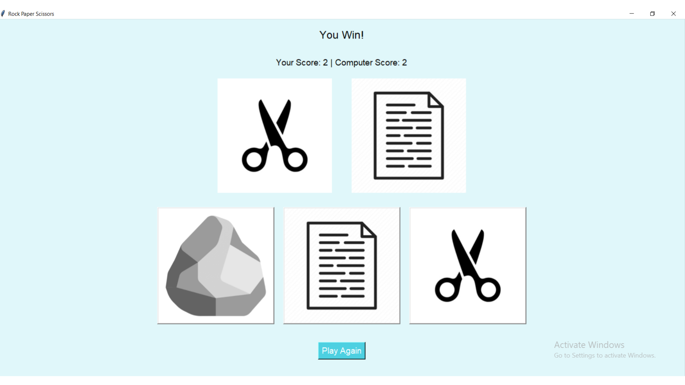
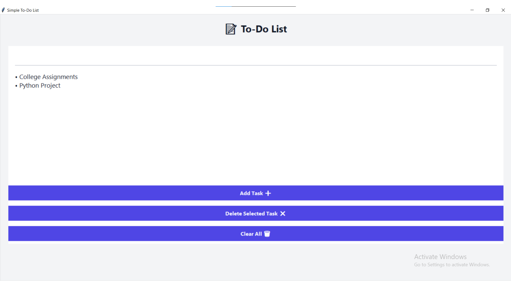

Python Tkinter Internship Projects

This repository contains multiple Python GUI applications developed during my internship using Tkinter.

📌 Projects Included

1️⃣ Calculator Application
- Performs basic arithmetic operations
- Clean and modern UI
- Error handling for invalid expressions

2️⃣ Password Generator
- Generates secure random passwords
- Adjustable password length using slider
- One-click copy to clipboard

3️⃣ Rock Paper Scissors Game
- Interactive game with images
- Real-time score tracking
- Computer vs User gameplay

4️⃣ To-Do List Application
- Add, delete, and clear tasks
- User-friendly interface
- Input validation

🛠 Technologies Used
- Python
- Tkinter
- Random & String modules

📷 Screenshots

Calculator Application


Password Generator


Rock Paper Scissors Game


To-Do List Application


▶️ How to Run the Projects

1. Make sure Python (3.x) is installed on your system.
2. Download or clone this repository:
   ```bash
   git clone https://github.com/AbhishekPatil2005/Python-Tasks.git

🎓 College Details

College Name: Nowrosjee Wadia College, Pune
Course: B.Sc. Information Technology
Academic Year: 2025–2026

🏢 Internship at CodSoft!

Internship Role: Python Programming Intern
Internship Type: Virtual Internship
Internship Duration: 4 Weeks

These projects were developed as part of my internship to gain hands-on experience in Python programming and GUI application development using Tkinter.
